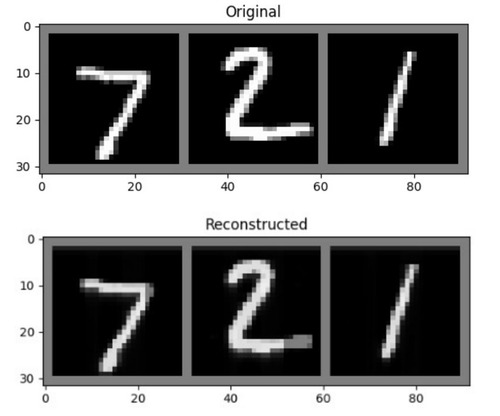

## About The Project
This project is an assignment
 from the course "Deep Learning".
  Several things that we learned in this project are:

1) Working with PyTorch
2) Convolotional Neural Networks
3) Woring with sequential data
4) LSTM Auto-Encoder

## Specific Details
We worked with three different datasets. Synthetic dataset, MNIST, and S&P500 stock prices.

For the Synthetic dataset, we trained LSTM Auto-Encoder which took as input data (sequential data) from the synthetic dataset, encode this data to a lower dimension and decode the output of the encoder.

For the MNIST dataset, we trained the LSTM Auto-Encoder that took the images of the MNIST dataset and refer to every image as sequential data (row-by-row). Then we added the option of classification to the AE by composing two objective functions. Then we repeat the same thing but instead of referring to every image as a row-by-row sequence we did it pixel-by-pixel.

For the S&P500 dataset, in addition, to training the LSTM AE, we modified the network to perform a prediction of the stock prices.

## Examples of the AE for the different datasets

The AE results on the MNIST dataset:

